<div align="center">
  
</div>

<div align="center">
  
</div>

<div align="center">
  
</div>

## 🚀 About Me

<div align="center">

```yaml
👨‍💻 Developer Profile:
  name: "Rohit Ghosh"
  location: "India 🇮🇳"
  education: "B.Tech in Computer Science"
  current_role: "Junior Software Developer @ EPAM Systems"
  experience: "1+ Years in Full Stack Development"
  
🎯 Expertise:
  frontend: ["React", "TypeScript", "JavaScript", "HTML5", "CSS3"]
  backend: ["Node.js", "Express.js", "RESTful APIs"]
  database: ["MongoDB", "MySQL"]
  currently_learning: ["Angular", "Advanced React Patterns"]
  
🌟 Interests:
  - "Web Development & Modern Frameworks"
  - "AI-Powered Applications"
  - "Problem Solving & Algorithms"
  - "Tech Innovation & Open Source"
  - "Building User-Centric Solutions"
```

</div>

## 🔥 Featured Project

<div align="center">
  <h3>
    
  </h3>
</div>

<div align="center">
  <table>
    <tr>
      <td align="center" width="50%">
        
        <br><br>
        
        
        
      </td>
      <td align="left" width="50%">
        <h4>🎯 What it does:</h4>
        <p>An intelligent resume builder that leverages AI text enhancers to create professional, ATS-optimized resumes automatically.</p>
        <h4>✨ Key Features:</h4>
        <ul>
          <li>AI-powered content enhancement</li>
          <li>Multiple professional templates</li>
          <li>Real-time preview & editing</li>
          <li>ATS optimization</li>
        </ul>
      </td>
    </tr>
  </table>
</div>

## 💻 Tech Stack & Skills

<div align="center">
  
</div>

### 🎨 Frontend Development
<div align="center">
<table>
<tr>
<td align="center" width="120">
  
  <br><strong>React</strong>
  <br><sub>⭐ Expert</sub>
</td>
<td align="center" width="120">
  
  <br><strong>TypeScript</strong>
  <br><sub>⭐ Advanced</sub>
</td>
<td align="center" width="120">
  
  <br><strong>JavaScript</strong>
  <br><sub>⭐ Expert</sub>
</td>
<td align="center" width="120">
  
  <br><strong>HTML5</strong>
  <br><sub>⭐ Expert</sub>
</td>
<td align="center" width="120">
  
  <br><strong>CSS3</strong>
  <br><sub>⭐ Advanced</sub>
</td>
</tr>
<tr>
<td align="center" width="120">
  
  <br><strong>Tailwind</strong>
  <br><sub>⭐ Advanced</sub>
</td>
<td align="center" width="120">
  
  <br><strong>Angular</strong>
  <br><sub>🌱 Learning</sub>
</td>
<td align="center" width="120">
  
  <br><strong>Figma</strong>
  <br><sub>⭐ Intermediate</sub>
</td>
<td align="center" width="120">
  
  <br><strong>Bootstrap</strong>
  <br><sub>⭐ Advanced</sub>
</td>
<td align="center" width="120">
  
  <br><strong>Sass</strong>
  <br><sub>⭐ Intermediate</sub>
</td>
</tr>
</table>
</div>

### ⚙️ Backend Development
<div align="center">
<table>
<tr>
<td align="center" width="120">
  
  <br><strong>Node.js</strong>
  <br><sub>⭐ Expert</sub>
</td>
<td align="center" width="120">
  
  <br><strong>Express.js</strong>
  <br><sub>⭐ Advanced</sub>
</td>
<td align="center" width="120">
  
  <br><strong>Python</strong>
  <br><sub>⭐ Intermediate</sub>
</td>
<td align="center" width="120">
  
  <br><strong>Django</strong>
  <br><sub>⭐ Intermediate</sub>
</td>
<td align="center" width="120">
  
  <br><strong>Java</strong>
  <br><sub>⭐ Intermediate</sub>
</td>
</tr>
</table>
</div>

### 🗄️ Database & Cloud
<div align="center">
<table>
<tr>
<td align="center" width="120">
  
  <br><strong>MongoDB</strong>
  <br><sub>⭐ Expert</sub>
</td>
<td align="center" width="120">
  
  <br><strong>MySQL</strong>
  <br><sub>⭐ Advanced</sub>
</td>
<td align="center" width="120">
  
  <br><strong>AWS</strong>
  <br><sub>⭐ Intermediate</sub>
</td>
<td align="center" width="120">
  
  <br><strong>Docker</strong>
  <br><sub>⭐ Intermediate</sub>
</td>
<td align="center" width="120">
  
  <br><strong>Firebase</strong>
  <br><sub>⭐ Intermediate</sub>
</td>
</tr>
</table>
</div>

### 🛠️ Tools & Development
<div align="center">
<table>
<tr>
<td align="center" width="120">
  
  <br><strong>Git</strong>
  <br><sub>⭐ Expert</sub>
</td>
<td align="center" width="120">
  
  <br><strong>GitHub</strong>
  <br><sub>⭐ Advanced</sub>
</td>
<td align="center" width="120">
  
  <br><strong>VS Code</strong>
  <br><sub>⭐ Expert</sub>
</td>
<td align="center" width="120">
  
  <br><strong>Jira</strong>
  <br><sub>⭐ Advanced</sub>
</td>
<td align="center" width="120">
  
  <br><strong>NPM</strong>
  <br><sub>⭐ Advanced</sub>
</td>
</tr>
</table>
</div>

## 🏆 GitHub Analytics & Achievements

<div align="center">
  
</div>

<div align="center">
  <table>
    <tr>
      <td align="center">
        
      </td>
      <td align="center">
        
      </td>
    </tr>
  </table>
</div>

<div align="center">
  
</div>

<div align="center">
  
</div>

### 🎯 Professional Highlights

<div align="center">
  <table>
    <tr>
      <td align="center" width="25%">
        
        <br><strong>Full Stack Development</strong>
      </td>
      <td align="center" width="25%">
        
        <br><strong>Junior Software Developer</strong>
      </td>
      <td align="center" width="25%">
        
        <br><strong>Modern Web Technologies</strong>
      </td>
      <td align="center" width="25%">
        
        <br><strong>Expanding Skillset</strong>
      </td>
    </tr>
  </table>
</div>

## 🌟 What I'm Up To

<div align="center">
  
</div>

<div align="center">
  <table>
    <tr>
      <td align="center" width="33%">
        
        <br><strong>AI Resume Builder</strong>
        <br><sub>React • Node.js • AI Integration</sub>
      </td>
      <td align="center" width="33%">
        
        <br><strong>Frontend Framework</strong>
        <br><sub>Expanding my skillset</sub>
      </td>
      <td align="center" width="33%">
        
        <br><strong>Professional Growth</strong>
        <br><sub>Full Stack Development</sub>
      </td>
    </tr>
  </table>
</div>

## 📫 Let's Connect & Collaborate

<div align="center">
  
</div>

<div align="center">
  <table>
    <tr>
      <td align="center">
        <a href="https://www.linkedin.com/in/rohit-ghosh-1682/" target="_blank">
          
        </a>
        <br><strong>Professional Network</strong>
      </td>
      <td align="center">
        <a href="mailto:rht.ghs10@gmail.com">
          
        </a>
        <br><strong>Direct Contact</strong>
      </td>
      <td align="center">
        <a href="https://github.com/rohit1682" target="_blank">
          
        </a>
        <br><strong>Code Repository</strong>
      </td>
    </tr>
  </table>
</div>

<div align="center">
  <br>
  
  
</div>

## 💡 Fun Facts & Interests

<div align="center">
  <table>
    <tr>
      <td align="center" width="25%">
        
        <br><sub>Love tackling complex challenges</sub>
      </td>
      <td align="center" width="25%">
        
        <br><sub>Always exploring new tech</sub>
      </td>
      <td align="center" width="25%">
        
        <br><sub>Collaboration is key</sub>
      </td>
      <td align="center" width="25%">
        
        <br><sub>Building the future</sub>
      </td>
    </tr>
  </table>
</div>

<!-- Animated footer with gradient -->
<div align="center">
  <br><br>
  
</div>

<div align="center">
  
</div>
