# Hi there! I'm Rohit Ghosh 👋

<div align="center">
  
</div>

## 🚀 About Me

<div align="center">

```yaml
name: Rohit Ghosh
location: India
education: B.Tech in Computer Science
current_role: Full Stack Developer
interests:
  - Web Development
  - Problem Solving
  - Tech Innovation
  - Open Source
```

</div>

## 💻 Tech Stack

<div align="center">

<table>
<tr>
<td align="center" width="140">
  
  <br>JavaScript
</td>
<td align="center" width="140">
  
  <br>TypeScript
</td>
<td align="center" width="140">
  
  <br>React
</td>
<td align="center" width="140">
  
  <br>Node.js
</td>
</tr>
<tr>
<td align="center" width="140">
  
  <br>Tailwind CSS
</td>
<td align="center" width="140">
  
  <br>AWS
</td>
<td align="center" width="140">
  
  <br>Git
</td>
<td align="center" width="140">
  
  <br>Docker
</td>
</tr>
</table>

</div>

## 🏆 Achievements

<div align="center">
  
  
</div>

## 📫 Connect With Me

<div align="center">
  <a href="https://www.linkedin.com/in/rohit-ghosh-1682/" target="_blank">
    
  </a>
  <a href="mailto:rht.ghs10@gmail.com">
    
  </a>
  <a href="https://github.com/rohit1682" target="_blank">
    
  </a>
</div>

<div align="center">
  
</div>

<!-- Gradient footer -->
<div align="center">
  
</div>
